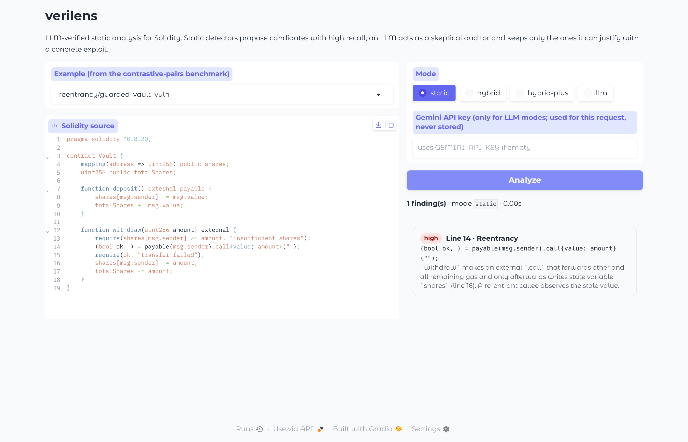
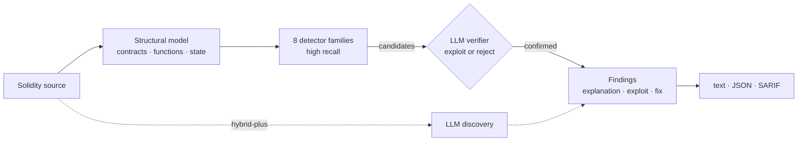

# verilens

**LLM-verified static analysis for Solidity smart contracts, with a reproducible benchmark.**

[](https://github.com/Rashiin/verilens/actions/workflows/ci.yml)


Static analyzers for smart contracts catch most known bug patterns, but they bury real issues under false alarms. LLMs can reason about context (who can call a function, whether a value is guarded elsewhere), but on their own they miss things and make findings up. **verilens** combines the two.

1. **Propose:** cheap, permissive detectors generate high-recall *candidates*, each mapped to the DASP / SWC taxonomy.
2. **Verify:** an LLM acts as a skeptical auditor. For every candidate it must either produce a concrete exploit or reject it as a false positive.
3. **(optional) Discover:** the LLM may add issues the detectors cannot express.



## Research question

> **Can LLM verification raise the precision of a static analyzer without sacrificing its recall, and how close does it get to a perfect verifier?**

To answer this, the project provides:

* **Analysis modes** that can be compared on the same inputs:
  * `static`: detectors only
  * `llm`: zero-shot LLM audit
  * `hybrid`: static, then LLM verification
  * `hybrid-plus`: hybrid plus LLM discovery
* **Two benchmarks:**
  * the public **SmartBugs-curated** set (143 contracts, pinned commit)
  * a new **contrastive-pairs** set: 17 vulnerable contracts, each with a *safe twin* that fixes the bug but keeps the suspicious-looking surface
* **A verification upper bound:** the score an *oracle* verifier would reach on the same candidates. It separates the error of the candidate generator from the error of the verifier.



## Results

All numbers below come from `results/` and can be regenerated with the commands in [Reproducing](#reproducing).

### Static baseline

| Benchmark | Category P | Category R | Category F1 | Line P (±2) | Line R (±2) | False alarms on safe twins |
|---|---:|---:|---:|---:|---:|---:|
| SmartBugs-curated (143) | 46.0 | 89.5 | 60.8 | 33.5 | 78.8 | n/a |
| Contrastive pairs (34) | 68.0 | **100.0** | 81.0 | 69.0 | **100.0** | 29.4% (5 / 17) |

The detectors behave as intended: they have **high recall and low precision**. On SmartBugs, 327 of the 492 reported lines (66%) match no label. On the contrastive set, 5 of the 17 *already-fixed* contracts are still flagged for the bug that was fixed. Typical cases:

* a custom re-entrancy mutex the detector does not recognise
* authorisation done through an internal helper (`_requireAdmin()`)
* a commit-reveal scheme that superficially resembles a public hash puzzle

These are exactly the cases where reasoning about context should help.

### Verification upper bound

If the verifier kept exactly the correct candidates (an oracle):

| Benchmark | Category P | Category R | Category F1 |
|---|---:|---:|---:|
| SmartBugs-curated | 100.0 | 83.9 | **91.2** (vs 60.8 static) |
| Contrastive pairs | 100.0 | 100.0 | **100.0** (vs 81.0 static) |

This is the headroom a verify-only approach can capture. The remaining SmartBugs recall gap (cross-function and cross-contract re-entrancy, logic bugs) can only be closed by discovery (`hybrid-plus`).

### LLM verification (hybrid mode)

First run: Gemini 3.5 Flash Lite, a small, free-tier model, at temperature 0 with all comments stripped.

| SmartBugs-curated (143) | Static | Hybrid | Perfect verifier |
|---|---:|---:|---:|
| Category precision | 46.0 | **62.2** | 100.0 |
| Category recall | 89.5 | 74.8 | 83.9 |
| Category F1 | 60.8 | **67.9** | 91.2 |
| Line precision (±2) | 33.5 | **51.0** | 100.0 |
| Line recall (±2) | 78.8 | 61.7 | 78.8 |

At line level, the static layer reports 492 candidates: 165 match a label, 327 do not.

* **The LLM rejected 241 of them.** It removed about **62% of the false alarms** (≈204 of 327), but also discarded about **22% of the true findings** (≈37 of 165).
* **Net effect: a clear precision and F1 gain.** That answers the first half of the research question positively.
* **The recall cost is concentrated** in unchecked low-level calls (recall 100 → 75) and timestamp dependence (80 → 20), where the small model tends to call real issues benign.
* **Reentrancy is the strongest case:** precision 71.8 → 84.4 with recall 90.3 → 87.1.

On the **contrastive pairs**, verification rejected 8 of 29 candidates and cut the **false-alarm rate on safe twins from 29.4% (5/17) to 0% (0/17)**. Every fixed contract that the detectors still flagged (custom mutex, auth through an internal helper, commit-reveal, guarded arithmetic, long-window timestamp check) was correctly cleared.

Closing the remaining gap to the 91.2 upper bound, with stronger models, self-consistency and calibrated thresholds, is the next step (see [Roadmap](#roadmap)). Full table: [`results/smartbugs-curated_hybrid_gemini-gemini-3.5-flash-lite.md`](results/smartbugs-curated_hybrid_gemini-gemini-3.5-flash-lite.md).

To reproduce or try another model:

```bash
pip install -e ".[certs]"          # certifi CA bundle; needed on macOS python.org installs
export GEMINI_API_KEY=...          # free key: https://aistudio.google.com/apikey
verilens bench --dataset pairs --mode hybrid --model gemini-3.5-flash-lite --rpm 12
verilens bench --dataset smartbugs --mode hybrid --model gemini-3.5-flash-lite --rpm 12
verilens bench --dataset smartbugs --mode llm --rpm 10
verilens bench --dataset smartbugs --mode hybrid-plus --rpm 10
```

Each report includes:

* precision, recall and F1 at category and line level, plus per-category tables
* the number of static candidates the LLM rejected
* LLM errors (verification **fails open**, so an API error never hides a finding; a run where *no* LLM call succeeds aborts instead of masquerading as a hybrid result)
* the cache hit count

Free API tiers are small (at the time of writing, some Gemini models allow only ~20 requests/day). When the daily quota runs out, `verilens` stops immediately and tells you; every answer received so far is cached, so **re-running the same command later resumes where it stopped**. Runs with any error are marked `INCOMPLETE` and should not be reported.

Runs with a local open-weight model work the same way: `--provider openai --base-url http://localhost:11434/v1 --model qwen2.5-coder:7b` (Ollama).

## Method details

**Structural model** (`solidity.py`). A dependency-free recovery of contracts, functions, modifiers, parameters and state variables. Comments and string literals are masked so patterns never match inside them, and character offsets stay aligned so every finding has an exact line number. It handles both legacy (0.4.x) and modern (0.8.x) syntax: old-style constructors, `function()` fallbacks, `call.value()()` and `call{value:}()`.

**Detectors** (`detectors/`). One family per DASP category:

| Category | Patterns (SWC) |
|---|---|
| Reentrancy | external `call` followed by a write to state or to a storage pointer into state, unless a guard modifier is present (SWC-107) |
| Access control | `tx.origin` auth, unprotected `selfdestruct` / `delegatecall`, privileged-variable writes without an auth check, mis-named constructors, array `.length` writes (SWC-105/106/112/115/118/124) |
| Arithmetic | compound and binary ops on state for compilers below 0.8 or inside `unchecked {}`, skipping operations guarded by a preceding check (SWC-101) |
| Unchecked calls | `send` / `call` / `delegatecall` whose boolean result is never consumed, including results assigned but never read (SWC-104) |
| Denial of service | external calls in loops, loops over growing storage arrays, push payments to stored addresses (SWC-113/128) |
| Bad randomness | block variables used as entropy (SWC-120) |
| Timestamp dependence | `block.timestamp` / `now` in comparisons and modulo (SWC-116) |
| Front running | ERC-20 approve race, public hash-puzzle solutions, payouts of state that another public function can change (SWC-114) |

**Verifier prompt** (`llm/prompts.py`). The contract is given with line numbers together with all of its candidates in a single call, so one contract costs one request (friendly to free tiers). The model returns strict JSON per candidate: verdict, confidence, explanation, exploit, fix. Candidates below `--threshold` confidence are dropped.

**Reproducibility.**

* Temperature 0.
* A content-addressed **response cache** (`.verilens_cache/`), so re-running a benchmark costs nothing and returns identical results.
* Client-side rate limiting and retries.
* SmartBugs is fetched at a **pinned commit**.

**Label-leakage control.** SmartBugs files contain their own ground truth (`// <yes> <report> REENTRANCY`, `@vulnerable_at_lines`), and many carry comments describing the bug. The loader strips **all comments** before analysis, preserving line numbers, so no mode (and no LLM) can read the answer. A test enforces this.

**Contrastive pairs** (`benchmarks/pairs/`).

* 17 hand-written pairs covering all 8 supported categories, in Solidity 0.4.24, 0.7.6 and 0.8.20. All 34 contracts compile with `solc`.
* Ground truth comes from `// @vuln <category>` markers on the vulnerable line (`build_labels.py` regenerates `labels.json`).
* Each safe twin fixes exactly one bug and is scored by the *safe-twin false-alarm rate*: whether the fixed category is still reported.

## Usage

```bash
pip install -e .                       # no runtime dependencies
verilens scan path/to/contracts/       # static mode, no key needed
verilens scan Token.sol --mode hybrid  # needs GEMINI_API_KEY
verilens scan src/ --format sarif -o verilens.sarif --fail-on-findings   # CI / GitHub code scanning

verilens fetch-smartbugs --dest data/smartbugs
verilens bench --dataset smartbugs --mode static
verilens bench --dataset pairs --mode static
```

**Demo UI:** `pip install -e ".[demo]" && python app/app.py`. The same file runs unchanged as a Hugging Face Space.

## Reproducing

```bash
pip install -e ".[dev]"
pytest                                   # 76 tests, offline, ~6 s
verilens fetch-smartbugs --dest data/smartbugs
verilens bench --dataset smartbugs --mode static --out results
verilens bench --dataset pairs --mode static --out results
```

## Limitations and threats to validity

* **The detectors are heuristics, not a full parser or data-flow analysis.** They over-approximate by design. Re-entrancy across functions or contracts is out of reach of the static layer.
* **SmartBugs labels are incomplete.** Each file is labelled for its showcased bug, so some "false positives" (e.g. real overflows in 0.4 contracts labelled only for re-entrancy) are true issues. This underestimates the precision of every tool.
* **The rules encode published SWC patterns, but were developed while looking at a handful of SmartBugs examples,** so the SmartBugs static numbers are likely optimistic. The contrastive set was written independently of the detectors' failure modes, but by the same author. It is small (n = 17 pairs) and should be read as a diagnostic, not a leaderboard.
* **LLM results vary across model versions.** Report the model string stored in each result file.

## Roadmap

* Slither as an alternative candidate generator (direct comparison of generators)
* Self-consistency (k samples per candidate) and calibration analysis of LLM confidence
* Larger, multi-annotator contrastive set; DeFi-specific categories (oracle manipulation, flash-loan attacks)

## Citation

```bibtex
@software{gholijani_farahani_verilens_2026,
  author = {Gholijani Farahani, Rashin},
  title  = {verilens: LLM-verified static analysis for Solidity smart contracts},
  year   = {2026},
  url    = {https://github.com/Rashiin/verilens}
}
```

SmartBugs-curated: Durieux et al., *Empirical Review of Automated Analysis Tools on 47,587 Ethereum Smart Contracts*, ICSE 2020.

## License

MIT for the code and the contrastive-pairs benchmark. SmartBugs-curated is downloaded at run time and keeps its own licenses.
